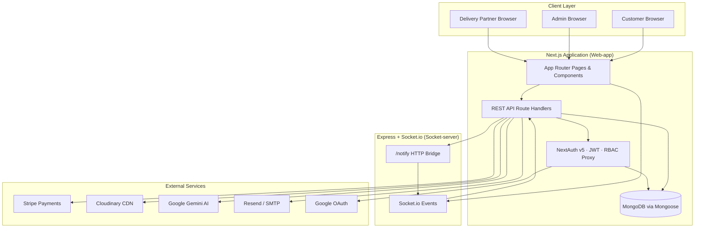
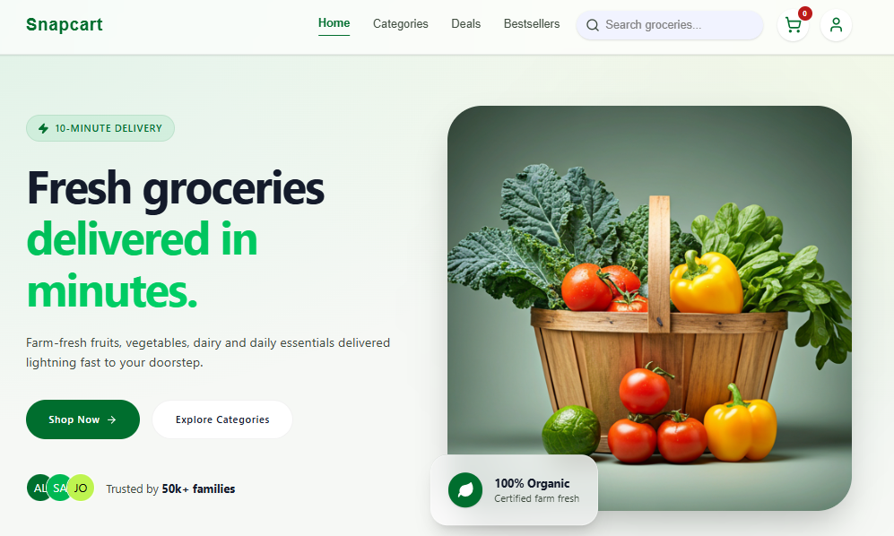
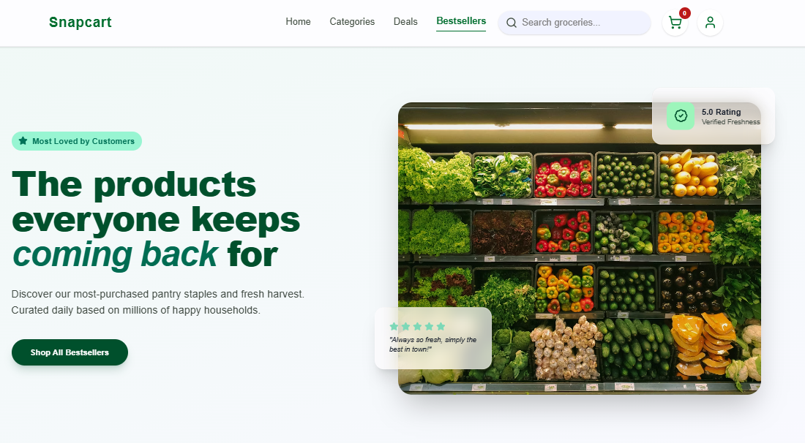

# SnapCart

[](https://nextjs.org/)
[](https://nodejs.org/)
[](https://expressjs.com/)
[](https://www.mongodb.com/)
[](https://www.typescriptlang.org/)
[](https://socket.io/)
[](https://stripe.com/)

**SnapCart** is a full-stack, production-oriented grocery delivery platform engineered for real-time commerce. It unifies customer shopping, admin operations, and last-mile delivery into a single scalable system — built with Next.js App Router, an Express + Socket.io real-time layer, and MongoDB.

---

## Overview

SnapCart delivers an end-to-end quick-commerce experience: browse groceries by category, apply flash and trending promotions, checkout with COD or Stripe, and track deliveries live on an interactive map. Admins orchestrate inventory, orders, and promotional campaigns from a data-driven dashboard. Delivery partners receive geo-proximity assignments, verify handoffs via OTP, and coordinate with customers through real-time chat enhanced by AI reply suggestions.

The architecture separates concerns cleanly — Next.js handles SSR, API routes, and auth; a dedicated Socket.io server powers live location, order events, and messaging — making the system horizontally extensible.

---

## Key Highlights

- **Multi-role platform** — Customer, Admin, and Delivery Partner workflows with JWT-based RBAC
- **Real-time delivery engine** — Socket.io broadcasts assignments, live GPS tracking, and in-app chat
- **Geo-aware dispatch** — MongoDB 2dsphere queries match nearby available delivery partners automatically
- **Dual payment rails** — Cash on Delivery and Stripe Checkout with webhook confirmation
- **Promotional commerce** — Admin-managed flash sales and trending product campaigns
- **AI-assisted communication** — Gemini-powered contextual chat suggestions for users and delivery partners
- **Enterprise integrations** — Cloudinary (media), Resend/Nodemailer (OTP email), Google OAuth, Leaflet maps

---

## Features

### Customer Experience
- Product discovery with search, categories, bestsellers, and promotional deals
- Redux-powered cart with persistent client state
- Checkout with geocoded address selection via interactive maps
- Order history, status tracking, and live delivery map
- Real-time chat with delivery partner and AI-suggested replies

### Admin Operations
- Analytics dashboard with revenue metrics and 7-day order charts (Recharts)
- Full grocery CRUD with Cloudinary image uploads
- Order lifecycle management with one-click status updates
- Flash sale and trending sale campaign management

### Delivery Operations
- Dedicated delivery partner registration flow
- Real-time assignment broadcast to nearby available partners
- GPS location streaming and live map visualization
- OTP-verified delivery confirmation via email
- Earnings tracking and assignment dashboard

---

## Tech Stack

| Layer | Technology |
|---|---|
| **Frontend** | Next.js 16, React 19, TypeScript, Tailwind CSS 4, Redux Toolkit |
| **Backend API** | Next.js Route Handlers (App Router) |
| **Real-Time Server** | Node.js, Express.js 5, Socket.io 4 |
| **Database** | MongoDB, Mongoose ODM |
| **Authentication** | NextAuth v5 (JWT), Credentials + Google OAuth, bcryptjs |
| **Payments** | Stripe Checkout + Webhooks |
| **Maps & Geo** | Leaflet, react-leaflet, MongoDB Geospatial Index |
| **Media** | Cloudinary |
| **Email** | Resend (primary), Nodemailer/Gmail (fallback) |
| **AI** | Google Gemini 2.5 Flash |
| **UI & Motion** | Lucide React, Motion, Recharts |

---

## System Architecture Overview



**Event flow (order dispatch):** Admin marks order *out for delivery* → API queries nearby delivery partners via `$near` geospatial index → assignment broadcasted over Socket.io → partner accepts → live GPS streamed → OTP verified → order marked delivered.

---

## User Roles & Capabilities

| Role | Access | Core Capabilities |
|---|---|---|
| **Customer** | `/user/*`, public catalog | Browse, cart, checkout (COD/Stripe), track orders, live chat |
| **Admin** | `/admin/*` | Dashboard analytics, grocery CRUD, order management, promo campaigns |
| **Delivery Partner** | `/delivery/*`, home dashboard | Receive assignments, GPS tracking, OTP delivery, customer chat |

Route access is enforced via role-based middleware (`proxy.ts`) with session validation on every protected request.

---

## Screenshots

### Homepage

The primary landing experience surfaces personalized grocery discovery, category navigation, and promotional stories — optimized for fast repeat ordering.



### Home Page with Active Order

Authenticated users see active order status directly on the homepage, enabling at-a-glance delivery tracking without navigating away from the shopping flow.


### Register Page

Multi-path registration supports customer and delivery partner onboarding with role selection, mobile verification, and secure credential creation.


### Login Page

Dual authentication via email/password credentials and Google OAuth, backed by NextAuth JWT sessions with role-aware redirects.


### Delivery Partner Authentication

Secure delivery personnel login with role-scoped session management, granting access to assignment queues, GPS-enabled order workflows, and real-time dispatch coordination.


### Categories Page

Structured category browsing across 10 grocery segments — from produce and dairy to household essentials — with responsive grid layouts.


### Bestsellers

Curated trending product listings highlight top-performing inventory with ratings, pricing, and one-tap add-to-cart actions.



### Bestsellers (Extended View)

Expanded bestseller catalog with horizontal scroll navigation, enabling deep product discovery within high-demand categories.


### Cart Page

Redux-managed cart with quantity controls, price breakdown (subtotal, delivery fee, total), and seamless checkout handoff.


### Deals Page (Overview)

Promotional hub showcasing limited-time flash sales and trending offers with countdown timers and urgency-driven UI patterns.


### Deals Page (Flash Sales)

Time-bound flash sale cards with stock indicators, discount badges, and inline cart integration for high-conversion impulse buying.


### Deals Page (Trending Sales)

Trending product campaigns with rating displays and promotional pricing — dynamically managed from the admin panel.


### Admin Panel

Operations command center featuring revenue analytics, order volume charts, customer metrics, and pending delivery monitoring.


---

## Project Structure

```
snapcart/
├── Web-app/                          # Next.js 16 full-stack application
│   ├── src/
│   │   ├── app/                      # App Router pages & API routes
│   │   │   ├── admin/                # Admin dashboard & management
│   │   │   ├── user/                 # Customer cart, checkout, orders
│   │   │   ├── api/                  # REST API route handlers
│   │   │   └── ...
│   │   ├── components/               # Shared UI components
│   │   ├── models/                   # Mongoose schemas
│   │   ├── redux/                    # Client state (cart, user)
│   │   ├── lib/                      # DB, socket, mailer, cloudinary
│   │   └── auth.ts                   # NextAuth configuration
│   └── package.json
├── Socket-server/                    # Express + Socket.io real-time server
│   └── index.js
├── images/                           # Application screenshots
└── README.md
```

---

## Installation & Setup

### Prerequisites

- Node.js 20+
- MongoDB Atlas cluster (or local instance)
- Stripe, Cloudinary, and Google OAuth credentials (see below)

### 1. Clone the repository

```bash
git clone https://github.com/your-username/snapcart.git
cd snapcart
```

### 2. Install dependencies

```bash
# Next.js application
cd Web-app
npm install

# Socket.io server
cd ../Socket-server
npm install
```

### 3. Configure environment variables

Create `.env.local` in `Web-app/` and `.env` in `Socket-server/` (see [Environment Variables](#environment-variables)).

### 4. Run development servers

```bash
# Terminal 1 — Next.js (port 3000)
cd Web-app
npm run dev

# Terminal 2 — Socket.io server (port 5000)
cd Socket-server
npm run dev
```

Open [http://localhost:3000](http://localhost:3000) to access the application.

---

## Environment Variables

### Web-app (`.env.local`)

| Variable | Description |
|---|---|
| `MONGODB_URL` | MongoDB connection string |
| `AUTH_SECRET` | NextAuth JWT signing secret |
| `GOOGLE_CLIENT_ID` | Google OAuth client ID |
| `GOOGLE_CLIENT_SECRET` | Google OAuth client secret |
| `NEXT_BASE_URL` | App base URL (e.g. `http://localhost:3000`) |
| `NEXT_PUBLIC_SOCKET_SERVER` | Socket.io server URL (e.g. `http://localhost:5000`) |
| `STRIPE_SECRET_KEY` | Stripe secret API key |
| `STRIPE_WEBHOOK_SECRET` | Stripe webhook signing secret |
| `CLOUDINARY_CLOUD_NAME` | Cloudinary cloud name |
| `CLOUDINARY_API_KEY` | Cloudinary API key |
| `CLOUDINARY_API_SECRET` | Cloudinary API secret |
| `GEMINI_API_KEY` | Google Gemini API key (chat suggestions) |
| `RESEND_API_KEY` | Resend API key (optional, preferred for email) |
| `EMAIL` | SMTP email address (Nodemailer fallback) |
| `PASS` | SMTP app password (Nodemailer fallback) |

### Socket-server (`.env`)

| Variable | Description |
|---|---|
| `PORT` | Server port (default: `5000`) |
| `NEXT_BASE_URL` | Next.js app URL for API callbacks |

---

## API Overview

| Domain | Endpoints | Purpose |
|---|---|---|
| **Auth** | `/api/auth/*`, `/api/auth/register` | Login, OAuth, registration |
| **User** | `/api/user/order`, `/api/user/payment`, `/api/user/my-orders` | Place orders, Stripe checkout, order history |
| **Admin** | `/api/admin/get-orders`, `/api/admin/add-grocery`, `/api/admin/update-order-status/[id]` | Order & inventory management |
| **Promotions** | `/api/admin/flash-sales`, `/api/admin/trending-sales`, `/api/flash-sales`, `/api/trending-sales` | Campaign CRUD & public feeds |
| **Delivery** | `/api/delivery/get-assignments`, `/api/delivery/otp/*`, `/api/delivery/assignment/[id]/accept-assignment` | Assignments, OTP, acceptance |
| **Real-Time** | `/api/socket/connect`, `/api/socket/update-location` | Socket identity & GPS persistence |
| **Chat** | `/api/chat/save`, `/api/chat/messages`, `/api/chat/ai-suggestions` | Messaging & AI reply suggestions |
| **Payments** | `/api/user/stripe/webhook` | Stripe payment confirmation |

Full route handlers live under `Web-app/src/app/api/`.

---

## Security & Best Practices

- **Authentication** — NextAuth v5 with JWT sessions, bcrypt password hashing, and Google OAuth
- **Authorization** — Role-based route protection on `/user`, `/admin`, and `/delivery` paths
- **API guards** — Server-side session checks on sensitive endpoints (admin, delivery OTP)
- **Payment integrity** — Stripe webhook signature verification before order status updates
- **Delivery verification** — OTP-based handoff confirmation sent via authenticated email channel
- **Database** — Mongoose schema validation, geospatial indexing, connection pooling via global cache
- **Media** — Server-side Cloudinary uploads; no client-side credential exposure

---

## Future Enhancements

- Push notifications for order status and assignment alerts
- Redis caching layer for catalog and session performance at scale
- Inventory stock management with low-stock alerts
- Admin RBAC with granular permission scopes
- Delivery partner performance analytics and SLA tracking
- Progressive Web App (PWA) with offline cart persistence
- Rate limiting and request throttling on public API routes

---

## Author

**Dhruv Kumar Singh**

Built as a production-grade grocery delivery platform demonstrating scalable architecture, real-time systems, and modern full-stack engineering practices.

---

<p align="center">
  <sub>SnapCart · Built with Next.js, Express.js, MongoDB & Socket.io</sub>
</p>
